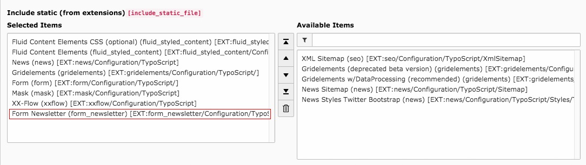

.. ==================================================
.. FOR YOUR INFORMATION
.. --------------------------------------------------
.. -*- coding: utf-8 -*- with BOM.

.. include:: ../Includes.txt

Configuration
=============

All you need to do is to include the static TypoScript file in your template.

    Adding static file to template

Finisher configuration
----------------------

* **Newsletter2go Auth Key:**

  Your unique auth key which can be found in your profile settings on
  `newsletter2go.de <https://www.newsletter2go.de>`_.

* **Newsletter2go Email:**

  The email address of your Newsletter2go account.

* **Newsletter2go Password:**

  The password of your Newsletter2go account.

* **Success PID:**

  The page the extension will redirect to if a recipient was successfully added.

* **Failure PID:**

  The page the extension will redirect to if a recipient was not successfully
  added.

* **Field Names:**

  Every field you use on Newsletter2go has a specific name.
  Insert all names in a comma separated list (e.g. value1,value2,value3).
  Make sure that the names on your list are in the same order as the form
  fields. Note that the field names are case sensitive. When using predefined
  fields like first name, last name, or email these names have to be used:
  first_name, last_name, email. See the
  `API documentation <https://docs.newsletter2go.com>`_ for more information.

.. note::
  Note that this finisher should be executed last because it uses Form's
  redirect finisher.

Example configuration
---------------------

.. figure:: ../Images/form-module.png
    :width: 714px
    :alt: Example configuration

    Example configuration
